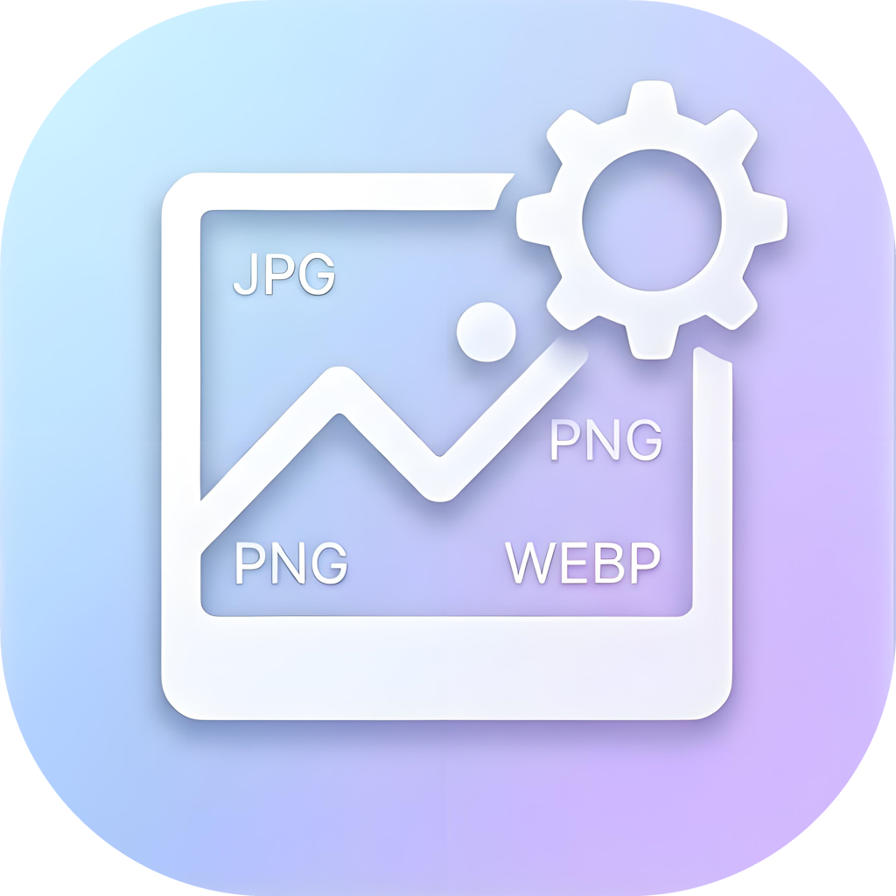
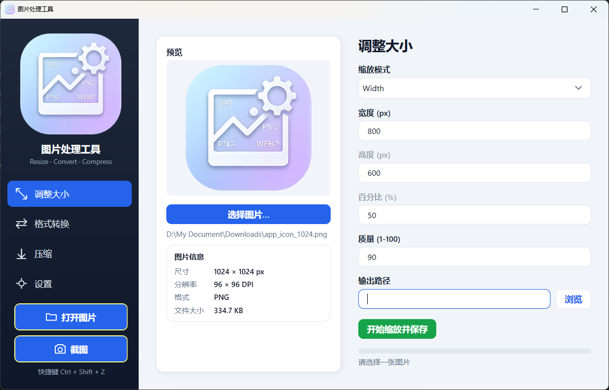
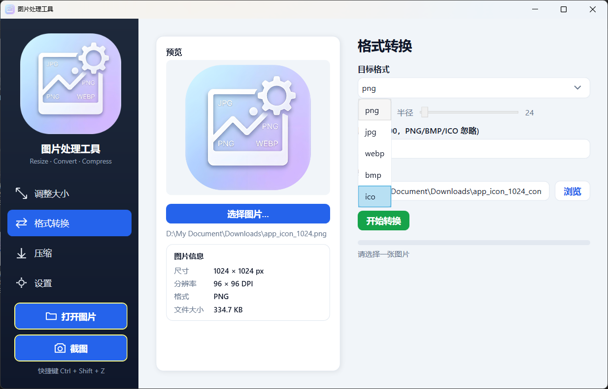
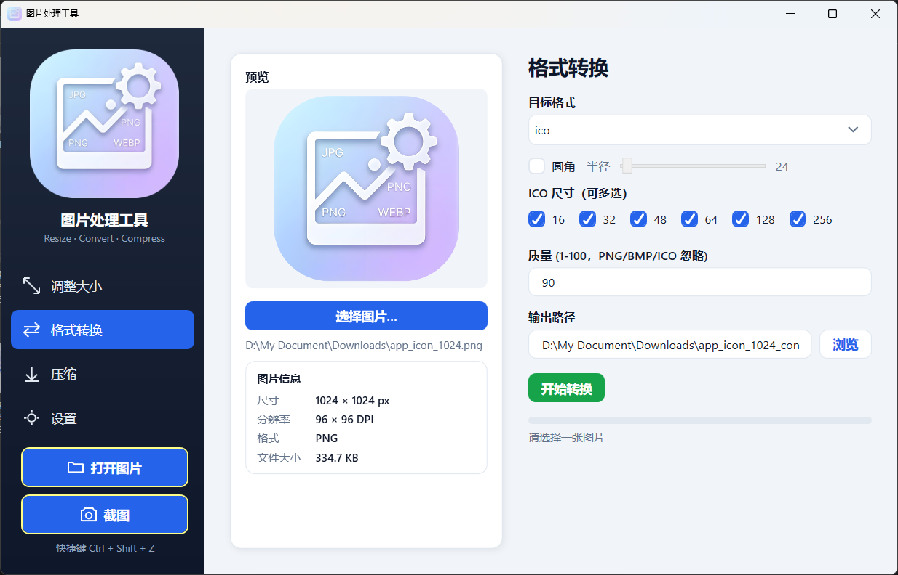
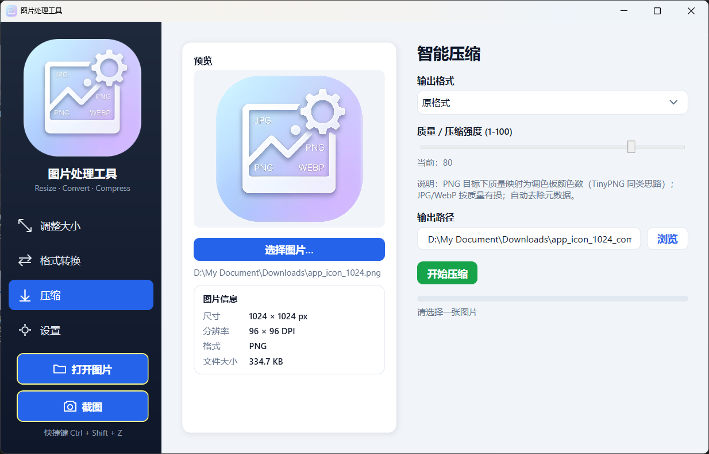
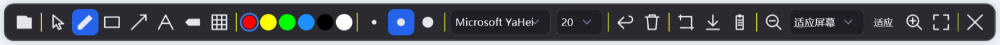

# 图片处理工具 · ImageTool

<p align="center">
  
</p>

<p align="center">
  <a href="#"></a>
  <a href="#"></a>
  <a href="#"></a>
  <a href="LICENSE"></a>
</p>

> 一个轻量、无广告、纯本地的 Windows 桌面图片处理工具。基于 **WPF + .NET 10**，图片引擎使用免费的 **SixLabors.ImageSharp**（MIT，纯 C#），不依赖任何第三方运行时，发布时可自包含为单文件 exe。

---

## 🖼️ 界面预览

<p align="center">
  <br>
  <em>主界面 · 调整大小</em>
</p>

<p align="center">
  <br>
  <em>主界面 · 格式转换（PNG）</em>
</p>

<p align="center">
  <br>
  <em>主界面 · 格式转换（ICO 多尺寸导出）</em>
</p>

<p align="center">
  <br>
  <em>主界面 · 智能压缩</em>
</p>

<p align="center">
  <br>
  <em>截图编辑器 · 标注工具栏</em>
</p>

---

## ✨ 功能特性

### 📸 截图与标注（Screenshot Editor）

全局快捷键（默认 `Ctrl + Shift + S`，可在设置中重新录制）随时唤起，即使主窗口最小化也能用。全屏捕获 → 框选区域裁剪后进入标注编辑器：

- 丰富的标注工具：**画笔 / 矩形 / 箭头 / 文字 / 高亮 / 马赛克**
- 笔触粗细三档（细 / 中 / 粗），颜色自由选取
- **撤销 / 清空**，支持导入现有图片进行再标注
- **裁剪到选区**，缩放查看（放大 / 缩小 / 适应屏幕）
- 一键**保存到文件**或**复制到剪贴板**

### 🔧 调整大小（Resize）

四种缩放模式满足不同场景：

- **按宽度 / 按高度 / 按百分比**：自动等比缩放，不变形
- **指定宽高（Exact）**：手动设定精确像素尺寸
  - 提供**「锁定比例」**勾选框，自动保持原图宽高比
  - **实时最终效果预览**：边改边看，比例不对立即可见
- 图片属性面板：显示尺寸 / 分辨率 / 格式 / 文件大小

### 🔄 格式转换（Convert）

支持 **PNG / JPG / WebP / BMP / ICO**，由输出扩展名决定目标格式：

- **圆角**处理：透明格式（PNG/WebP）圆角外透明，不透明格式（JPG/BMP）圆角外填白
- **ICO 多尺寸导出**：一键生成 16 / 24 / 32 / 48 / 64 / 128 / 256 多档图标（可多选组合）
- 圆角半径根据图片尺寸动态适配范围
- 图片属性面板

### 🗜️ 智能压缩（Compress）

输出格式可选（原格式 / PNG / JPG / WebP / BMP）：

- 质量滑块：PNG 下采用**调色板量化**（TinyPNG 同类思路，质量映射为颜色数），JPG/WebP 按质量有损压缩
- 自动剥离 EXIF / IPTC / XMP 元数据以减小体积
- 状态栏显示**体积节省百分比**

### ⚙️ 设置与系统特性

- **全局快捷键重录**：无需记忆默认键，随时改
- **开机自启**：写入当前用户注册表 `HKCU\Software\Microsoft\Windows\CurrentVersion\Run`（无需管理员权限）
- **系统托盘常驻**：最小化到托盘，双击打开主界面，右键菜单（打开主界面 / 截图 / 设置 / 退出）
- 所有图片操作在后台线程执行，UI 不卡顿；进度实时回传

---

## 🚀 快速开始

### 环境要求
- Windows 10 / 11
- [.NET 10 SDK](https://dotnet.microsoft.com/download)（Runtime 即可运行发布版）

### 从源码运行
```bash
# 在项目根目录
dotnet run -c Release
```

### 用 Visual Studio
打开 `ImageTool.slnx`，按 `F5` 调试。

### 发布为独立 exe（无需安装 .NET 运行时）
```bash
dotnet publish -c Release -r win-x64 --self-contained true
```
生成物位于 `bin/Release/net10.0-windows/win-x64/publish/`，可单文件分发。

---

## 🖱️ 使用说明

| 功能 | 入口 | 说明 |
|------|------|------|
| 截图 | 主界面「快捷操作 → 截图」或全局快捷键 | 唤起全屏捕获，框选后进入编辑器标注 |
| 打开图片 | 主界面「打开图片」或在截图编辑器中点「打开图片」 | 载入本地图片用于转换 / 压缩 / 标注 |
| 调整大小 | 侧边栏「调整大小」 | 选模式、填尺寸，Exact 可锁定比例并实时预览 |
| 格式转换 | 侧边栏「格式转换」 | 选目标扩展名，可开圆角或导出 ICO 多尺寸 |
| 压缩 | 侧边栏「压缩」 | 拉质量滑块，观察体积节省 |
| 设置 | 侧边栏「设置」 | 重录快捷键、开关开机自启 |

> 截图、全局热键、全屏捕获依赖真实 Windows 桌面环境，请在 Visual Studio 或发布 exe 中运行验证。

---

## 🏗️ 技术架构

**架构分层**

```
App (启动 → 托盘 / 全局热键 / 截图流程编排)
 ├─ TrayService          系统托盘图标 + 右键菜单
 ├─ HotkeyService        Win32 RegisterHotKey 全局热键
 ├─ ScreenshotService    全屏捕获 (Graphics.CopyFromScreen)
 └─ MainWindow (XAML + 侧边栏导航 ContentControl)
      └─ MainViewModel
           ├─ ResizeViewModel    → IImageService.Resize
           ├─ ConvertViewModel   → IImageService.Convert
           ├─ CompressViewModel  → IImageService.Compress
           └─ SettingsViewModel  → StartupManager / HotkeyService / SettingsStore
                            ↓
                     ImageService (SixLabors.ImageSharp 实现)
 └─ ScreenshotEditorWindow (截图编辑器：选择 / 标注 / 裁剪 / 保存)
```

- **MVVM**：轻量 `ViewModelBase`（`INotifyPropertyChanged` + 异步命令 + 进度回调），视图与逻辑解耦
- **图片引擎**：`IImageService` 接口 + `ImageService`（ImageSharp 实现），便于替换或扩展
- **统一 UI 样式**：`Resources/Styles.xaml` 集中管理按钮 / 复选框 / 下拉框 / 卡片等样式，全站一致

**目录结构**

```
ImageTool/
├── App.xaml(.cs)               # 启动、全局热键、托盘、截图编排
├── MainWindow.xaml(.cs)        # 主窗口（侧边栏导航 + 内容区）
├── Assets/                     # 源图标资源（app.ico 由 <ApplicationIcon> 嵌入 exe；app_icon_1024.png 作为 WPF 资源嵌入程序集，发布后无需随附文件夹）
├── ReadMeAssets/               # README 展示截图
├── Converters/                 # 值转换器（BoolToOpacity / BoolToVisibility / ProgressWidth …）
├── Models/                     # 数据模型与枚举（ResizeMode 等）
├── Resources/
│   └── Styles.xaml             # 统一 UI 样式体系
├── Services/                   # 业务服务（图片引擎 / 热键 / 托盘 / 开机自启 / 设置存储）
├── ViewModels/                 # MVVM 视图模型
└── Views/                      # 界面（调整大小 / 转换 / 压缩 / 设置 + 截图编辑器窗口）
```

---

## 🗺️ 路线图

- [ ] 批量处理（多图队列）
- [ ] 拖拽导入
- [ ] 浅色 / 深色主题切换
- [ ] 更多标注工具与图层
- [ ] 国际化（i18n）

欢迎提交 Issue 与 Pull Request 一起完善。

---

## 🤝 贡献

1. Fork 本仓库
2. 创建特性分支 (`git checkout -b feature/YourFeature`)
3. 提交改动 (`git commit -m 'Add some feature'`)
4. 推送到分支 (`git push origin feature/YourFeature`)
5. 发起 Pull Request

---

## 📄 许可证

本项目基于 [MIT 许可证](LICENSE) 开源。

## 🙏 致谢

- [SixLabors.ImageSharp](https://github.com/SixLabors/ImageSharp) — 免费、跨平台、纯 C# 的图片处理库（MIT）
